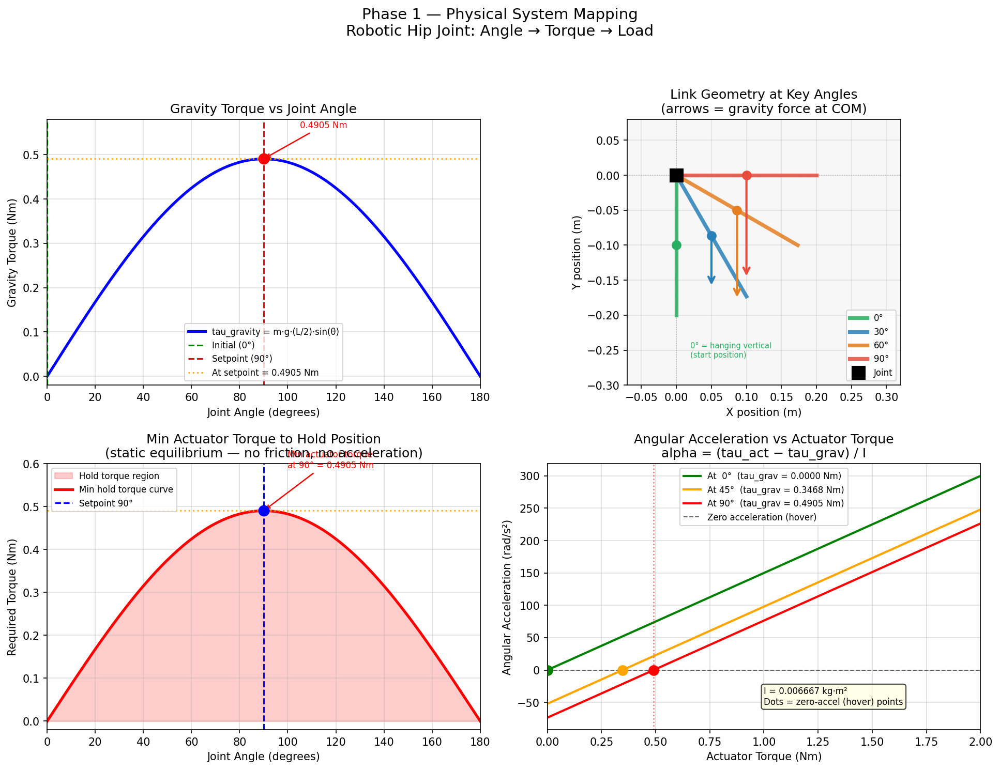
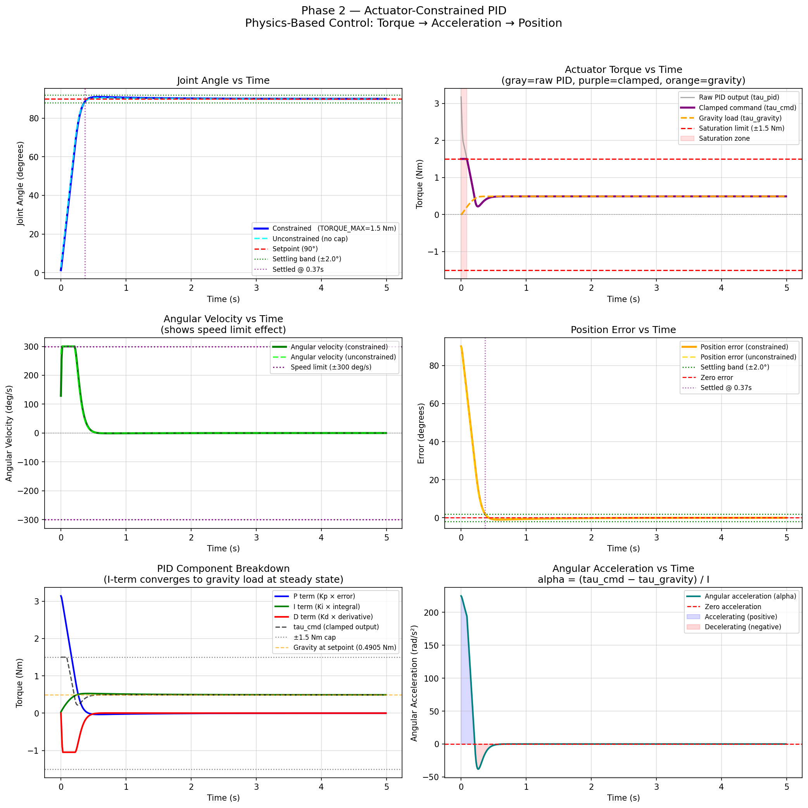
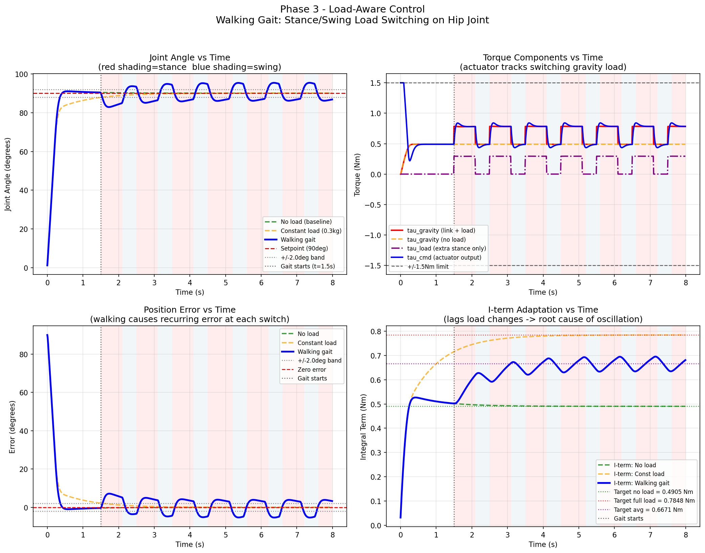
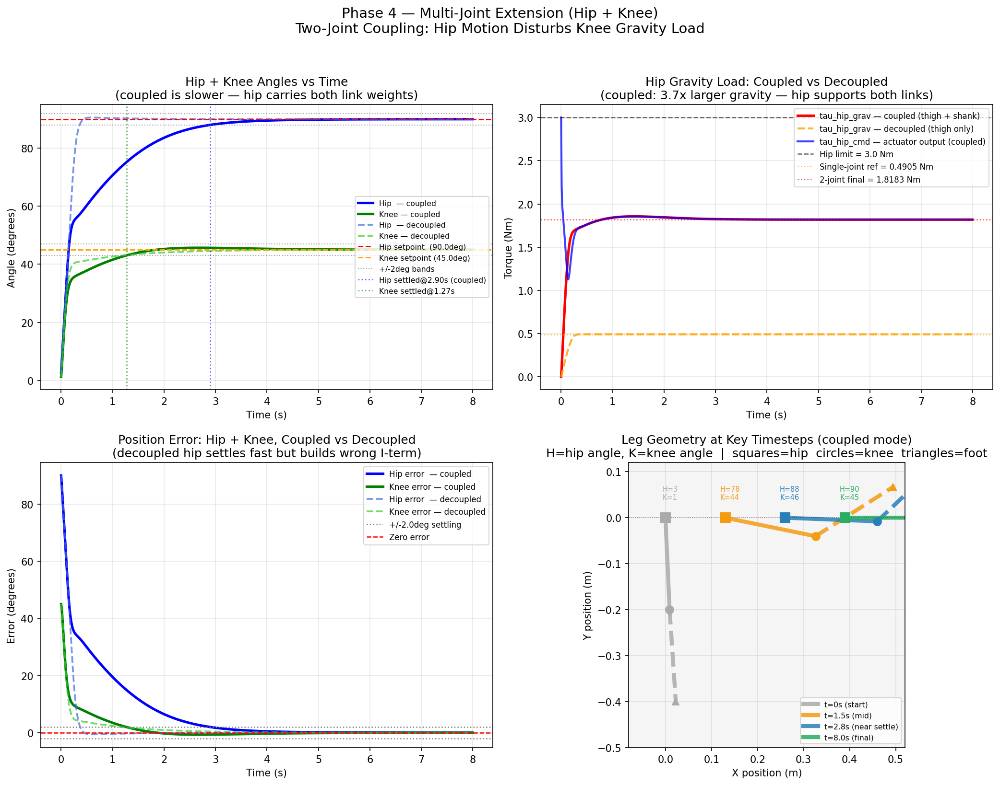
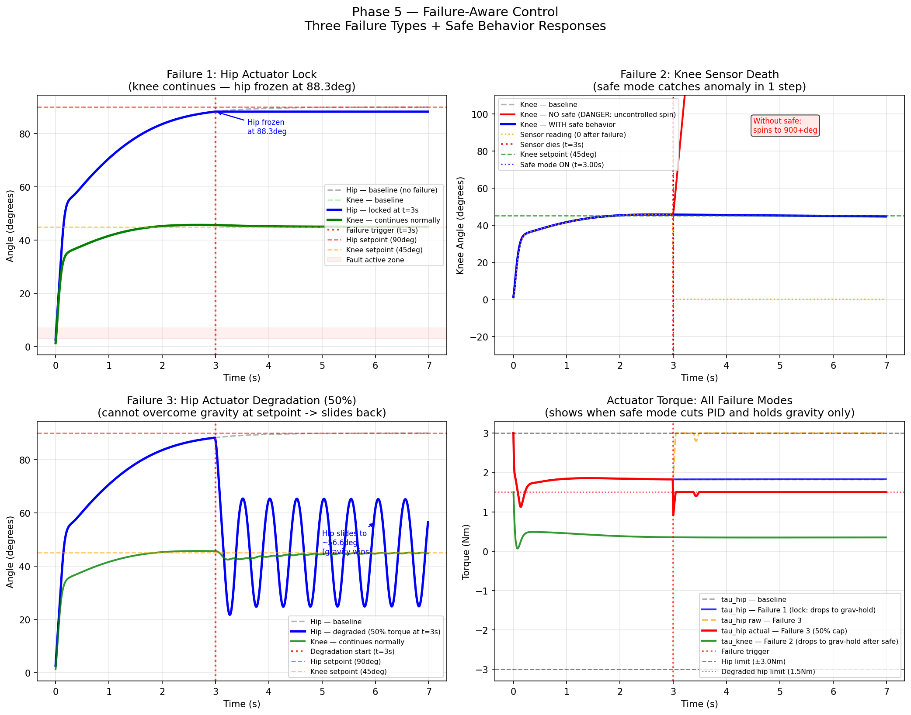
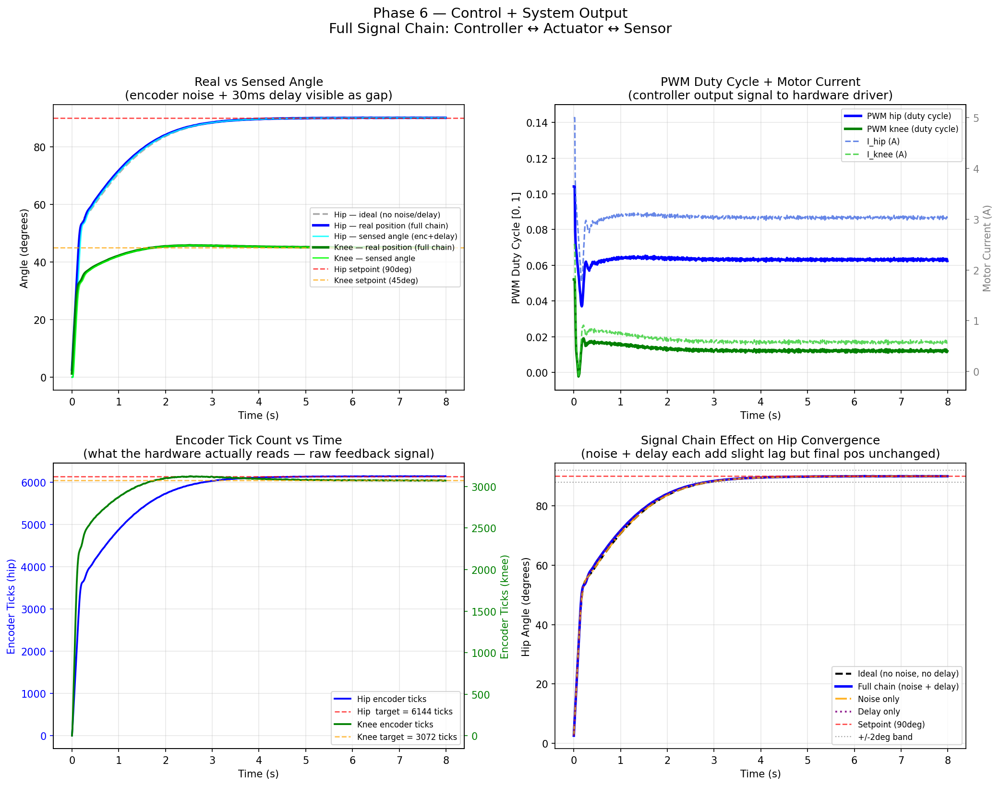
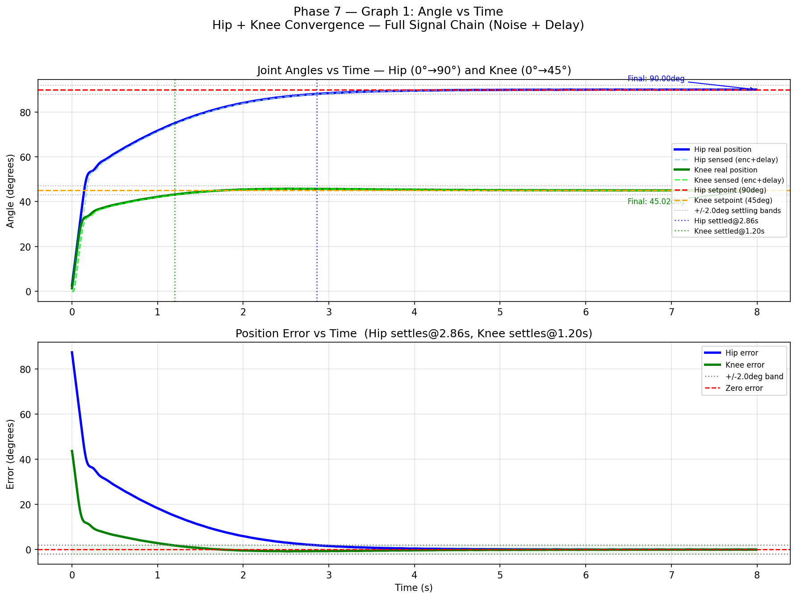
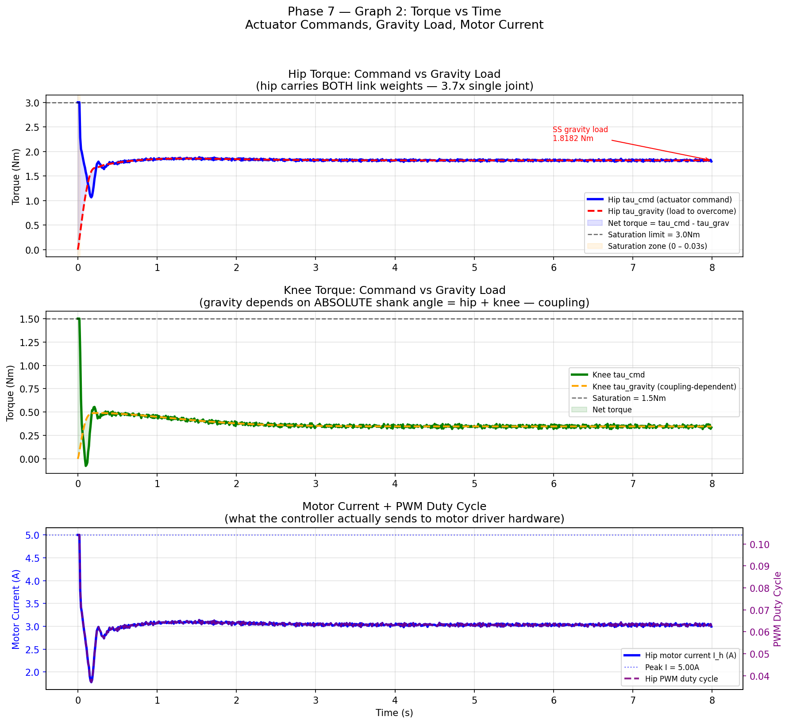
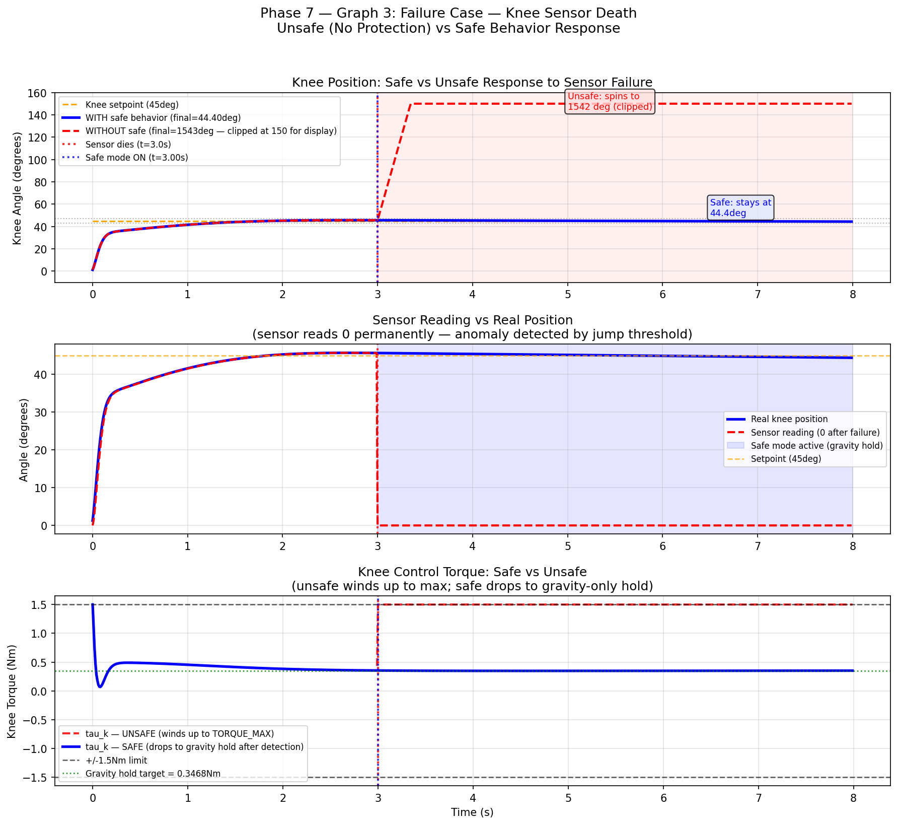

# Physics-Linked Actuator Control + Quadruped Joint Integration

**Author:** Rugved  
**Task:** Robotics Systems — Task 2  
**Builds on:** Task 1 (abstract PID simulation)  
**Type:** Standalone simulation system — designed for real actuator deployment  

---

## What Changed From Task 1

Task 1 moved a joint using `pos += control * DT` — no physics, no units.

Task 2 replaces that with:

```
alpha = (tau_actuator - tau_gravity) / I     [rad/s²]
omega += alpha * DT                          [rad/s]
theta += omega * DT                          [rad → degrees]
```

Every number now has a real unit. Every torque is in Newton-metres.  
Every output signal maps to a real PWM duty cycle and motor current.

---

## System Definition

| Parameter | Value |
|-----------|-------|
| Controlled joints | Hip (thigh) + Knee (shank) |
| Hip setpoint | 90° (thigh horizontal) |
| Knee setpoint | 45° (shank relative to thigh) |
| Both start at | 0° |
| Control algorithm | PID — output in Newton-metres |
| Control rate | 100 Hz (DT = 0.01s) |
| Scale | Mini Cheetah quadruped |

---

## Project Structure

```
task2_actuator_control/
│
├── phase1_physical_mapping.py
├── phase2_actuator_pid.py
├── phase3_load_aware.py
├── phase4_multijoint.py
├── phase5_failure_aware.py
├── phase6_system_output.py
├── phase7_final_graphs.py
│
├── phase1_graph.png
├── phase2_actuator_pid_graph.png
├── phase3_load_aware_graph.png
├── phase4_multijoint_graph.png
├── phase5_failure_aware_graph.png
├── phase6_system_output_graph.png
├── phase7_graph1_angle_vs_time.png
├── phase7_graph2_torque_vs_time.png
├── phase7_graph3_failure_case.png
│
└── REVIEW_PACKET.md
```

---

## Physical Parameters

| Parameter | Value | Unit |
|-----------|-------|------|
| Thigh mass | 0.5 | kg |
| Thigh length | 0.20 | m |
| Shank mass | 0.5 | kg |
| Shank length | 0.20 | m |
| Moment of inertia | 0.006667 | kg·m² |
| Hip TORQUE_MAX | 3.0 | Nm |
| Knee TORQUE_MAX | 1.5 | Nm |
| OMEGA_MAX | 300 | deg/s |
| Kp / Ki / Kd | 2.0 / 2.0 / 0.20 | Nm/rad |
| Control rate | 100 | Hz |
| Motor Kt | 0.10 | Nm/A |
| Gear ratio | 6:1 | — |
| Encoder | 4096 | ticks/rev |
| Sensor delay | 30 | ms |

---

## Phase Breakdown

---

### Phase 1 — Physical System Mapping

Converts angle to real physics. Defines the equation of motion used by all future phases.

```
tau_gravity = m × g × (L/2) × sin(θ)
alpha       = (tau_actuator − tau_gravity) / I
```

At setpoint 90°, gravity load = **0.4905 Nm** (single joint).  
With two joints in Phase 4, hip load becomes **1.8182 Nm**.



---

### Phase 2 — Actuator-Constrained PID

PID output is now in Newton-metres. Actuator saturation is physical — capped at TORQUE_MAX.

I-term at steady state = **0.4907 Nm** — matches gravity at 90° (0.4905 Nm) to 4 decimal places.  
Proves integral is doing correct gravity compensation.

| Metric | Constrained (1.5 Nm) | Unconstrained |
|--------|----------------------|---------------|
| Final error | 0.0000° | 0.0000° |
| Settling time | 0.37s | 0.35s |
| Overshoot | 0.985° | 0.53° |
| Time saturated | 2.0% | 0% |



---

### Phase 3 — Load-Aware Control

Walking gait: 0.3 kg load during stance (60%), zero during swing (40%), 1 Hz cycle.  
Load switching starts at t = 1.5s after system settles.

Root cause of oscillation: integral adapts slowly, load switches every 0.6s.  
Result: **±7.15° error** on each gait cycle.

| Run | Final pos | Max error during gait |
|-----|-----------|-----------------------|
| No load | 90.0003° | 1.84° |
| Constant load | 89.9984° | 1.99° |
| Walking gait | 86.76° | 7.15° |



---

### Phase 4 — Multi-Joint Extension (Hip + Knee)

Two joints with real coupling. When hip moves, knee gravity torque changes even if knee is stationary.

```python
# Hip supports BOTH links
tau_hip = m_thigh*g*(L/2)*sin(th_hip)
        + m_shank*g*[L_thigh*sin(th_hip) + (L/2)*sin(th_hip + th_knee)]

# Knee gravity depends on ABSOLUTE shank angle — the coupling
tau_knee = m_shank*g*(L/2)*sin(th_hip + th_knee)
```

| Metric | Task 1 (single joint) | Task 2 (two joints) |
|--------|-----------------------|---------------------|
| Hip gravity at setpoint | 0.4905 Nm | 1.8182 Nm |
| Hip settling time | 0.36s | 2.90s |
| Hip load ratio | 1.0× | **3.7×** |



---

### Phase 5 — Failure-Aware Control

Three failures, all triggered at t = 3.0s.

**Failure 1 — Hip actuator lock:** Joint freezes at 88.27°. Safe: gravity-hold only, integral frozen. Knee continues.

**Failure 2 — Knee sensor death:** Encoder returns 0° permanently.

| Mode | Knee final position |
|------|-------------------|
| Without safe behavior | **1542.6°** (DANGEROUS — uncontrolled spin) |
| With safe behavior | **44.40°** (SAFE — near setpoint) |

Detection: sensor jump > 15° in one step → safe mode triggers in **10ms**.

**Failure 3 — Hip actuator degradation (50%):** Max torque drops to 1.5 Nm. Gravity at setpoint = 1.8183 Nm > 1.5 Nm → hip cannot hold. Slides back to **56.6°**.



---

### Phase 6 — Control + System Output

Complete signal chain — every signal has a unit and maps to real hardware.

**Output (controller → motor driver):**
```
tau_cmd → tau_motor = tau_cmd / GEAR  →  I = tau_motor / Kt  →  V = I × R  →  PWM = V / V_supply
```

**Feedback (encoder → controller):**
```
theta → encoder ticks → ±2 tick noise → 30ms delay → sensed_angle
```

| Mode | Hip final pos | Hip settle time |
|------|--------------|----------------|
| Ideal (no noise, no delay) | 89.9992° | 2.90s |
| Full chain | 89.9984° | 2.83s |
| Difference | **0.0008°** | 0.07s |

Integral absorbs both noise and delay — negligible steady-state impact.



---

### Phase 7 — Final Graphs + Analysis

Three final output graphs summarising the complete system.

**Graph 1 — Angle vs Time**  
Hip (0°→90°) and knee (0°→45°) convergence. Real vs sensed angle shows encoder + delay gap.  
Hip settles at 2.83s. Knee settles at 1.17s.



---

**Graph 2 — Torque vs Time**  
Hip torque command vs gravity load (1.8182 Nm at steady state).  
Motor current and PWM duty cycle — actual hardware output signals.



---

**Graph 3 — Failure Case**  
Knee sensor death at t = 3.0s.  
Unsafe: spins to 1542°. Safe: stays at 44.4°.  
Safe mode drops PID and holds gravity-only torque.



---

## Key Results Summary

| Phase | Key Finding |
|-------|-------------|
| 1 | Gravity at 90° = 0.4905 Nm — minimum actuator requirement |
| 2 | I-term converges to exactly gravity load (0.4907 Nm) |
| 3 | Walking gait causes ±7.15° error — integral lag under fast switching |
| 4 | Hip gravity = 1.8182 Nm (3.7× Task 1) — two joints need stronger actuator |
| 5 | Safe mode catches fault in 10ms — prevents 1542° runaway |
| 6 | Noise + 30ms delay → only 0.0008° extra steady-state error |
| 7 | All three graphs confirm end-to-end system correctness |

---

## Failures Handled

| Failure | Phase | Safe Result |
|---------|-------|-------------|
| Actuator saturation | 2 | Converges, slightly slower |
| Walking gait load switching | 3 | ±7.15° error — expected behavior |
| Two-joint gravity coupling | 4 | 3.7× hip load, 2.90s settling |
| Actuator lock (hard jam) | 5 | Freezes at 88.3°, knee continues |
| Sensor death (reads 0°) | 5 | 44.4° (safe) vs 1542° (unsafe) |
| Actuator degradation (50%) | 5 | Slides to 56.6° equilibrium |
| Encoder noise + delay | 6 | Negligible — 0.0008° error |

---

## Stability Observations

**Gravity compensation** is handled entirely by the integral term. At steady state the I-term equals the gravity torque at the setpoint exactly — this is verifiable in every phase's print output.

**Coupling** is the most significant real-world effect. The hip must work 3.7× harder than a single-joint model predicts. Task 1 underestimates actuator requirements because it ignores the shank weight on the hip.

**Sensor failure** is the most dangerous failure mode. Without protection, a dead encoder causes infinite-error PID windup and uncontrolled joint rotation. The 10ms detection response (1 control step) prevents any meaningful displacement before safe mode activates.

---

## Limitations

- Single leg only — full quadruped requires 4 legs with coordinated gait
- No friction model in joint dynamics
- No back-EMF in motor model (`V ≈ I × R` only)
- Walking load is a simplified step function
- No anti-windup on integral during saturation
- PID gains manually tuned — not optimized via Ziegler-Nichols or LQR
- Simulation only — no real hardware interface

---

## How to Run

```bash
pip install matplotlib numpy scipy
```

```bash
python phase1_physical_mapping.py
python phase2_actuator_pid.py
python phase3_load_aware.py
python phase4_multijoint.py
python phase5_failure_aware.py
python phase6_system_output.py
python phase7_final_graphs.py
```

Each script prints step-by-step logs, displays graphs, and saves PNG files.

---

## Task 1 → Task 2: What Was Added

| Aspect | Task 1 | Task 2 |
|--------|--------|--------|
| Position update | `pos += ctrl * DT` | `alpha=(tau−grav)/I; omega; theta` |
| Gravity | Not modeled | `m*g*(L/2)*sin(θ)` in Nm |
| Torque units | Dimensionless | Newton-metres (Nm) |
| Joints | 1 | 2 (hip + knee, coupled) |
| Actuator model | None | Kt, gear ratio, torque limits |
| Signal output | Abstract number | PWM duty + motor current (A) |
| Sensor model | Direct read | 12-bit encoder + noise + 30ms delay |
| Walking load | None | Stance/swing gait cycle |
| Failure handling | None | 3 types + jump-detect safe mode |
| Signal chain | Not defined | tau → PWM → physics → encoder → PID |
